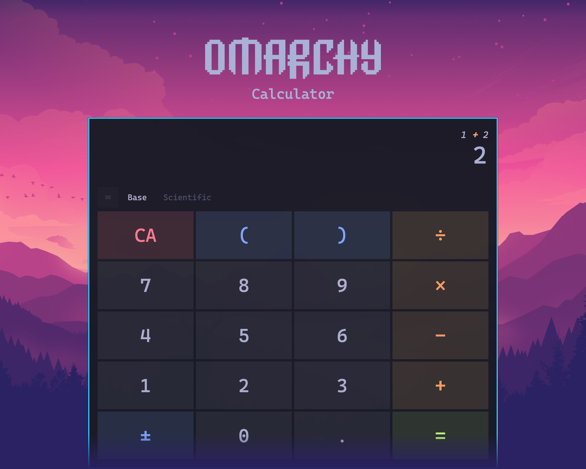

The official Omarchy calculator app, made with Flutter.

## Roadmap

This list contains a list of missing features. Feel free to contribute!

* **Primary**
    [ ] Customizable shortcuts
    [ ] Developer mode (binary operations, etc.)
    [ ] Localization
    [ ] Graphing capabilities
    [ ] Unit/Currency conversions
    [ ] Accessibility improvements
* **Secondary**
    [ ] Android support
